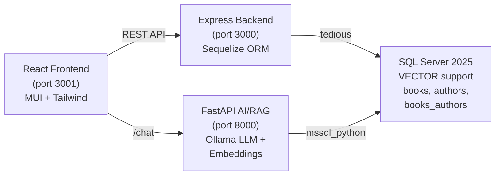
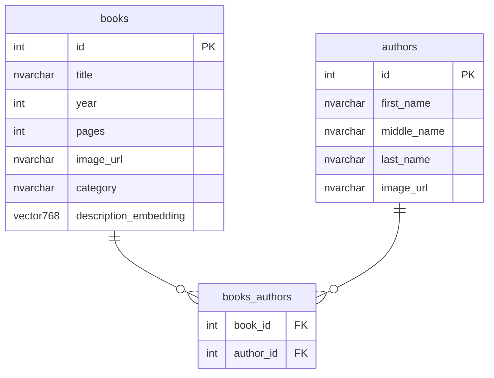

[](https://codespaces.new/croblesm/library-app)
[](https://vscode.dev/redirect?url=vscode://ms-vscode-remote.remote-containers/cloneInVolume?url=https://github.com/croblesm/library-app)

# Library App

A full-stack library management application with AI-powered book recommendations, built to demonstrate **SQL Server 2025's native VECTOR data type**, Node.js, React, and GitHub Copilot integration with the MSSQL extension.

## Architecture



## Tech Stack

| Layer | Technology | Details |
|-------|-----------|---------|
| Frontend | React 18, MUI v7, Tailwind CSS v4 | Single-page app with axios for API calls |
| Backend | Node.js, Express 4.19, Sequelize 6.37 | REST API with code-first schema |
| AI/RAG Service | Python, FastAPI, LangChain | Semantic search + natural language responses |
| Database | SQL Server 2025 | Native VECTOR(768) for embeddings |
| Embeddings | Ollama nomic-embed-text | 768-dimensional vectors |
| LLM | Ollama llama3.2:3b | Natural language generation for chat |
| Infrastructure | Terraform | Microsoft Fabric provisioning (optional) |
| Auth | Microsoft Entra ID | Fabric mode only, via @azure/identity |

---

## Prerequisites

- **VS Code** with the following extensions:
  - [MSSQL extension](https://marketplace.visualstudio.com/items?itemName=ms-mssql.mssql) -- for creating SQL Server containers and querying the database
  - [GitHub Copilot](https://marketplace.visualstudio.com/items?itemName=GitHub.copilot) -- AI-powered code completion
- **Node.js** >= 18 and npm ([download](https://nodejs.org/))
- **Python** >= 3.8 and pip ([download](https://www.python.org/))
- **Docker** (recommended for running SQL Server locally) ([download](https://www.docker.com/))
- **Git**

For AI features:
- **Ollama** ([install](https://ollama.com/download))

Optional:
- **Terraform** >= 1.5.7 (for Microsoft Fabric infrastructure)
- **Azure CLI** (for Entra ID authentication with Fabric)

> [!TIP]
> Use the **Open in GitHub Codespaces** or **Open in Dev Container** buttons above to get a pre-configured environment with all prerequisites installed.

---

## Project Structure

```
library-app/
├── app/
│   ├── backend/                        # Node.js/Express API server
│   │   ├── ai/                         # Python AI services
│   │   │   ├── chat_service.py         # FastAPI RAG semantic search service
│   │   │   ├── backfill_embeddings.py  # Embedding generation script
│   │   │   ├── requirements.txt        # Python dependencies
│   │   │   ├── .env                    # Python DB connection config
│   │   │   └── .env.example            # Template
│   │   ├── config/                     # Database configuration
│   │   │   ├── db.js                   # Sequelize initializer (Fabric + local)
│   │   │   ├── config.js               # Sequelize CLI config
│   │   │   ├── .env                    # Backend DB credentials
│   │   │   └── .env.example            # Template
│   │   ├── models/                     # Sequelize ORM models
│   │   │   ├── book.model.js           # Book model
│   │   │   ├── author.model.js         # Author model
│   │   │   ├── books_authors.model.js  # Junction table
│   │   │   └── initModels.js           # Model registration + associations
│   │   ├── routes/                     # Express route handlers
│   │   │   ├── Book.js                 # /books endpoints
│   │   │   ├── Author.js               # /authors endpoints
│   │   │   └── BooksAuthors.js         # /books_authors endpoints
│   │   ├── seeders/                    # Sequelize seeders (test data)
│   │   ├── scripts/                    # Utility scripts (drop tables)
│   │   ├── index.js                    # Express entry point
│   │   └── package.json
│   └── frontend/
│       └── library-frontend/           # React SPA
│           ├── src/
│           │   ├── ModernApp.js        # Main app component
│           │   ├── ModernApp.css       # Styles
│           │   └── index.js            # Entry point
│           └── package.json
├── docs/                               # Documentation
│   ├── PRD.md                          # Product Requirements Document
│   └── demos/                          # Step-by-step demo walkthroughs
│       ├── github-copilot-demo.html    # GitHub Copilot + MSSQL extension demo
│       ├── library-ai-ready-demo.html  # AI-ready demo (VECTOR + RAG)
│       ├── library-demo-flow.html      # End-to-end demo flow
│       └── schema-designer-demo.html   # Schema Designer demo
├── infrastructure/                     # Terraform files for Microsoft Fabric
├── .devcontainer/
│   └── devcontainer.json               # Dev container / Codespaces configuration
├── .github/
│   └── copilot-instructions.md         # GitHub Copilot custom instructions
├── AGENTS.md                           # Cross-platform AI agent instructions
├── CLAUDE.md                           # Claude Code project context
├── .cursorrules                        # Cursor AI instructions
└── README.md                           # This file
```

---

## Quick Start (Local SQL Server with Docker)

### 1. Clone the Repository

```bash
git clone <repository-url>
cd library-app
```

### 2. Install Dependencies

```bash
# Backend
cd app/backend
npm install

# Frontend
cd ../frontend/library-frontend
npm install
```

### 3. Create SQL Server 2025 Container

Use the **MSSQL extension for VS Code** to create and start the SQL Server container:

1. Open the **SQL Server** view in the VS Code sidebar (database icon)
2. Click **Add Connection** > **Create Local SQL Server**
3. The extension will pull the SQL Server 2025 Docker image and create the container for you

> [!NOTE]
> Make sure Docker Desktop is running before creating the container. The MSSQL extension handles all Docker configuration automatically.

### 4. Configure Environment Variables

Copy the `.env.example` template and fill in your credentials:

```bash
cp app/backend/config/.env.example app/backend/config/.env
```

Edit `app/backend/config/.env` with your local SQL Server settings:

```env
DB_SERVER=<your-server,your-port>
DB_USER=<your-username>
DB_PASSWORD=<your-password>
DB_DATABASE=Library
```

> [!TIP]
> You can find your connection details in the MSSQL extension's connection properties. The default port is `1433` and the default username is `sa`.

### 5. Create the Database

```bash
cd app/backend
npx sequelize-cli db:create
```

This creates the empty `Library` database using your `.env` configuration.

> [!NOTE]
> This command works for local SQL Server only. For Microsoft Fabric, create the database via Terraform, Azure portal, or Fabric portal (see [Microsoft Fabric Setup](#microsoft-fabric-setup-alternative)).

### 6. Start the Backend

```bash
cd app/backend
npm start
```

The backend starts on **http://localhost:3000**. On first run, Sequelize automatically creates all tables.

### 7. Seed the Database

In a new terminal:

```bash
cd app/backend
npx sequelize-cli db:seed:all
```

This populates the database with **29 authors** (with profile photos), **~200 books**, all book-author associations, and the `GetBooksWithAuthors` stored procedure.

### 8. Start the Frontend

In a new terminal:

```bash
cd app/frontend/library-frontend
npm start
```

The frontend opens at **http://localhost:3001**.

---

## AI/RAG Setup (Semantic Search)

The AI service adds semantic book search using SQL Server 2025's VECTOR data type, Ollama embeddings, and a RAG (Retrieval-Augmented Generation) pipeline.

### 1. Install Ollama

```bash
# macOS/Linux
curl -fsSL https://ollama.com/install.sh | sh

# Windows: download from https://ollama.com/download
```

### 2. Start Ollama

Start the Ollama server in a dedicated terminal and **keep it running**:

```bash
ollama serve
```

> [!IMPORTANT]
> The Ollama server must be running before you can pull models or use the AI service. On systems without systemd (e.g., GitHub Codespaces), you must start it manually each time.

### 3. Pull the Required Models

In a **new terminal** (while `ollama serve` is still running):

```bash
ollama pull nomic-embed-text   # Embedding model (768-dimensional)
ollama pull llama3.2:3b         # LLM for natural language responses
```

### 4. Add the VECTOR Column to SQL Server
Run these SQL statements against your Library database:

```sql
-- Add VECTOR column for embeddings (768-dimensional for nomic-embed-text)
ALTER TABLE books
ADD description_embedding VECTOR(768) NULL;

-- Create index for optimal vector search performance
CREATE INDEX IX_books_description_embedding
ON books(description_embedding);
```

### 5. Install Python Dependencies

```bash
cd app/backend/ai
pip install -r requirements.txt
```

### 6. Configure the Python Environment

Copy the `.env.example` template and fill in your credentials:

```bash
cp app/backend/ai/.env.example app/backend/ai/.env
```

Edit `app/backend/ai/.env` with your SQL Server connection string:

```env
MSSQL_CONNECTION_STRING=Server=<your-server>;Database=Library;UID=<your-username>;PWD=<your-password>;TrustServerCertificate=yes;
```

> [!IMPORTANT]
> The Python service uses ADO.NET-style connection strings with `UID` and `PWD` (not `User Id` and `Password`). This is a different format from the Node.js backend's `.env` file.

### 7. Generate Embeddings

```bash
cd app/backend/ai
python backfill_embeddings.py
```

This generates 768-dimensional vector embeddings for all books using the `nomic-embed-text` model and stores them in the `description_embedding` column.

### 8. Start the Chat Service

```bash
cd app/backend/ai
python chat_service.py
```

The service starts on **http://localhost:8000**. Interactive API docs are available at **http://localhost:8000/docs**.

### 9. Test Semantic Search

```bash
curl -X POST http://localhost:8000/chat \
  -H "Content-Type: application/json" \
  -d '{"question": "I want to read science fiction about space exploration"}'
```

The chat widget is also integrated into the React frontend (bottom-right corner).

### RAG Intelligence

The chat service uses smart query detection and similarity thresholds to deliver relevant results:

- **Category detection**: Recognizes genre names (e.g., "science fiction", "fantasy") and common aliases ("sci-fi", "thriller")
- **Topic-to-genre mapping**: Common topics auto-map to genres (e.g., "space exploration" → Science Fiction, "dragons" → Fantasy)
- **Author detection**: Matches full names or last names (e.g., "Asimov", "books by Clarke")
- **Similarity thresholds**: Category queries (0.20), author queries (0.25), general queries (0.60) — stricter for general queries to avoid irrelevant recommendations
- **Conversational responses**: All responses use a warm, librarian tone — including fallbacks when the LLM fails or no good matches are found
- **Latency breakdown**: The terminal logs timing for each stage (`embedding`, `sql_vector_search` in ms, `llm`, `total`)

### Performance Tuning

The AI service performance can be tuned via `app/backend/ai/.env`:

| Variable | Default | Description |
|----------|---------|-------------|
| `LLM_NUM_PREDICT` | 150 | Max tokens to generate (lower = faster) |
| `OLLAMA_NUM_THREAD` | 0 | CPU threads for inference (0 = auto-detect) |
| `LLM_TEMPERATURE` | 0.1 | LLM creativity (lower = more deterministic) |

> [!TIP]
> For live demos, set `LLM_NUM_PREDICT=100` for faster responses (~3-5s). Limit SQL Server container CPU/memory to free resources for Ollama inference.

---

## Microsoft Fabric Setup (Alternative)

If you want to use Microsoft Fabric SQL Database instead of a local Docker container:

### 1. Provision Infrastructure with Terraform

```bash
cd infrastructure
terraform init
terraform plan -out main.tfplan
terraform apply main.tfplan
```

> [!NOTE]
> Update `infrastructure/terraform.tfvars` with your Fabric capacity name. To find it: go to your Fabric workspace settings, then click **License info**.

### 2. Configure Environment for Fabric

Create `app/backend/config/.env` with:

```env
DB_CONNECTION_STRING=mssql://<your-fabric-server>.msit-database.fabric.microsoft.com:1433/<your-db>?encrypt=true&trustServerCertificate=false
```

> [!NOTE]
> - The `sequelize-cli db:create` command does **not** work for Fabric SQL Databases. Create the database via Terraform, Azure portal, or Fabric portal.
> - Fabric connections use Microsoft Entra ID (Azure Active Directory) authentication via `DefaultAzureCredential`. Make sure you are logged in with the Azure CLI (`az login`).

---

## API Reference

### Backend REST API (port 3000)

| Method | Endpoint | Description | Body / Query |
|--------|----------|-------------|-------------|
| GET | `/books` | List all books with authors | `?search=keyword` (optional) |
| POST | `/books` | Create a book | `{ title, year, pages, image_url, category, authorId }` |
| PUT | `/books/:id` | Update a book | `{ title, year, pages, image_url, category }` |
| DELETE | `/books/:id` | Delete a book and its associations | -- |
| GET | `/authors` | List all authors with their books | -- |
| POST | `/authors` | Create an author | `{ first_name, middle_name, last_name, image_url }` |
| DELETE | `/authors/:id` | Delete an author | -- |
| GET | `/books_authors` | List all book-author associations | -- |
| POST | `/books_authors` | Create a book-author association | `{ book_id, author_id }` |
| DELETE | `/books_authors` | Delete a book-author association | `{ book_id, author_id }` |

### AI Chat Service (port 8000)

| Method | Endpoint | Description | Body |
|--------|----------|-------------|------|
| POST | `/chat` | Semantic search + RAG response | `{ question, conversation_history? }` |
| GET | `/` | Service info | -- |
| GET | `/health` | Health check (verifies DB connection) | -- |
| GET | `/docs` | Swagger UI | -- |

**Example chat response:**

```json
{
  "question": "I want to read science fiction about space exploration",
  "response": "Based on our library collection, I recommend...",
  "results": [
    {
      "id": 9,
      "title": "2001: A Space Odyssey",
      "category": "Science Fiction",
      "year": 1968,
      "author": "Arthur C. Clarke",
      "similarity_score": 0.89
    }
  ]
}
```

---

## Database Schema



**Seed data:** 29 authors (Asimov, Clarke, Dick, Wells, Verne, Herbert, Tolkien, and more -- each with Wikipedia profile photos) and ~200 books across 16 categories including Science Fiction, Fantasy, Cyberpunk, Dystopian, Non-Fiction, and more.

---

## Documentation & Demo Guides

### Product Requirements Document

The [PRD](docs/PRD.md) defines the full scope of the application — data model, user stories, API endpoints, seed data, and non-goals. Use it as the source of truth for what the app should and shouldn't do.

### GitHub Copilot Custom Instructions

The project includes a [GitHub Copilot custom instructions file](.github/copilot-instructions.md) that teaches GitHub Copilot about the project's conventions: SQL Server only, Sequelize patterns, lowercase snake_case naming, `global.models` access, and more. This file is automatically loaded by GitHub Copilot in VS Code whenever you work in this repository, helping it generate code that follows the project's rules without you having to repeat them.

> [!TIP]
> Additional AI agent instruction files are included for other tools: [AGENTS.md](AGENTS.md) (Codex, Cline, Windsurf, Gemini CLI, Aider), [CLAUDE.md](CLAUDE.md) (Claude Code), and [.cursorrules](.cursorrules) (Cursor).

### Demo Walkthroughs

Interactive HTML guides are available in [`docs/demos/`](docs/demos/) for reproducing live presentations:

| Demo | File | Description |
|------|------|-------------|
| GitHub Copilot + MSSQL | [`github-copilot-demo.html`](docs/demos/github-copilot-demo.html) | Using GitHub Copilot with the MSSQL extension for database development |
| AI-Ready with SQL Server 2025 | [`library-ai-ready-demo.html`](docs/demos/library-ai-ready-demo.html) | Adding VECTOR columns, embeddings, and semantic search |
| Schema Designer | [`schema-designer-demo.html`](docs/demos/schema-designer-demo.html) | Visual schema design with the MSSQL extension |
| End-to-End Flow | [`library-demo-flow.html`](docs/demos/library-demo-flow.html) | Full demo orchestration from setup to AI search |

Open any `.html` file in a browser to follow along step-by-step with copyable code snippets.

---

## Cleanup / Reset

### Drop All Tables (Any Database)

```bash
cd app/backend
node ./scripts/dropAllTables.js
```

### Drop Database (Local SQL Server Only)

```bash
cd app/backend
npx sequelize-cli db:drop
```

> [!NOTE]
> This command does not work for Microsoft Fabric SQL Database. For Fabric, drop the database manually via the Azure/Fabric portal.

### Destroy Fabric Infrastructure

```bash
cd infrastructure
terraform destroy
```

> [!IMPORTANT]
> This permanently deletes all provisioned Fabric resources.

---

## Troubleshooting

### SQL Server Connection Issues

- **Docker not running:** Verify the container is running with `docker ps`. Restart with `docker start sql2025`.
- **Port conflict:** Ensure port 1433 is not in use by another process.
- **Fabric connection:** Verify `DB_CONNECTION_STRING` format. Ensure you are logged in with `az login`.

### Different Connection String Formats

The Node.js backend and Python AI service use **different** `.env` formats:

| Service | File | Format |
|---------|------|--------|
| Node.js backend | `app/backend/config/.env` | Separate vars: `DB_SERVER`, `DB_USER`, `DB_PASSWORD`, `DB_DATABASE` |
| Python AI service | `app/backend/ai/.env` | Single string: `MSSQL_CONNECTION_STRING=Server=...;Database=...;UID=...;PWD=...;` |

### Sequelize Sync Errors

- First run may show warnings as tables are being created -- this is normal.
- If schema changes fail: run `node ./scripts/dropAllTables.js` from `app/backend`, then restart the backend.

### Ollama Issues

- Ensure `ollama serve` is running before starting the AI service.
- Verify models are available: `ollama list`
- Required models: `nomic-embed-text` (embeddings) and `llama3.2:3b` (LLM)

### CORS Errors

- The Express backend allows all origins via the `cors()` middleware.
- The Python AI service allows requests from `http://localhost:3001` and `http://127.0.0.1:3001` by default. Override with the `CORS_ORIGINS` environment variable in `app/backend/ai/.env`.

### Vector Search Returns No Results

Verify embeddings exist in the database:

```sql
SELECT TOP 5 id, title,
  CASE WHEN description_embedding IS NOT NULL
       THEN 'Embedding exists'
       ELSE 'No embedding'
  END AS EmbeddingStatus
FROM books;
```

If embeddings are missing, re-run the backfill script:

```bash
cd app/backend/ai
python backfill_embeddings.py
```

### Vector Dimension Mismatch

If you change the embedding model, the vector dimensions must match:
1. Check your model's output dimension
2. Drop and re-create the `description_embedding` column with the correct size
3. Re-run the backfill script
